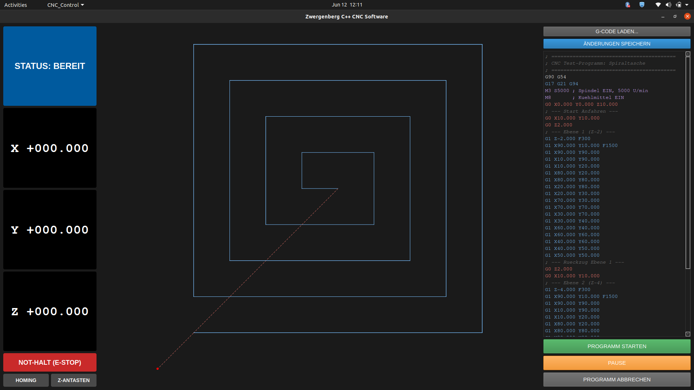
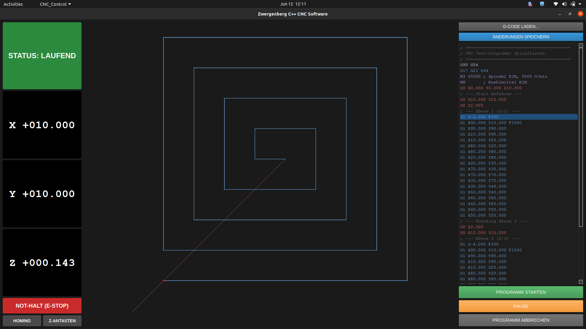
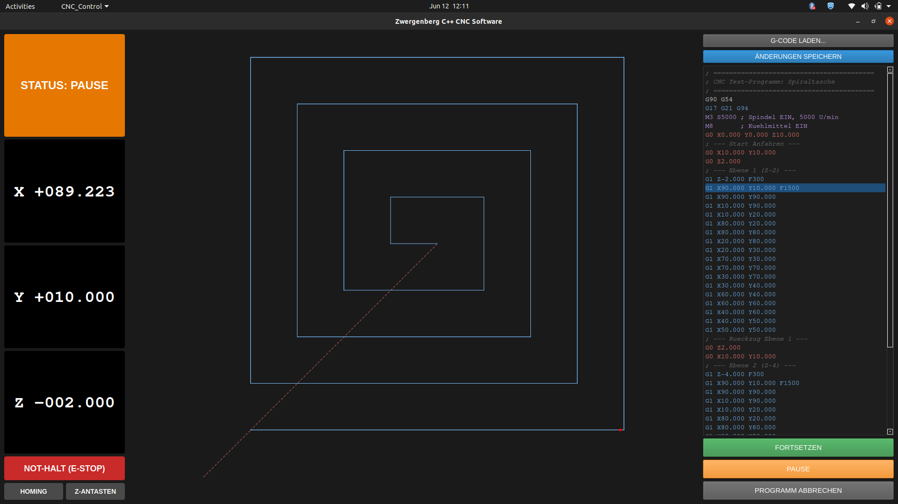

# cnc-control-software
CNC Control Software that provides basic motor control functionality for 3 axis, accompanied by a Graphical User Interface. 

Split into two parts: 
-  Directory containing the Core files to upload on an STM32H723VGT6. 
-  Trajectory Planner with GUI which runs under Linux (tested on Ubuntu 20.04) on a Host PC or RaspberryPi5

